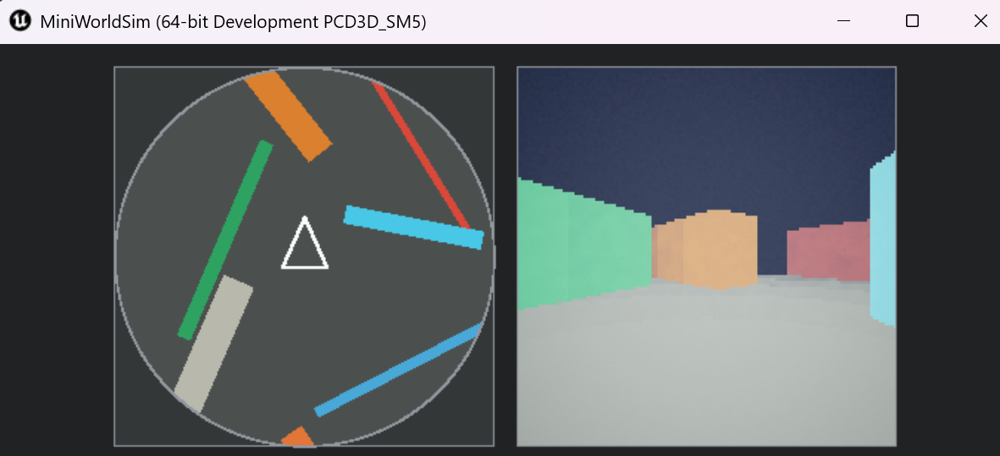
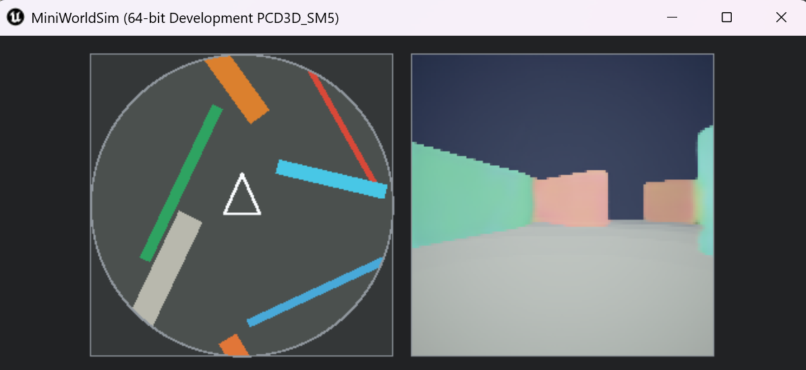

# Mini World Sim

Mini World Sim is a small neural-rendering experiment built around a deliberately simple 3D world. The project uses Unreal Engine as a convenient local simulator and synthetic-data generator, but the experiment is not about Unreal specifically; the same idea could be tested with a much simpler renderer.

The core question is:

```text
If a model is given the current local minimap, can it render the corresponding first-person 3D view?
```

This is loosely inspired by world-model / learned-renderer ideas, but the project is intentionally much smaller. The world is flat ground plus colored wall blocks. The goal is not to build a useful game engine replacement; it is to make the simplest possible local experiment that can test whether the training loop, data generation process, and live model-in-the-loop rendering are plausible on a consumer GPU.

## Screenshots

| Training data view | Neural renderer output |
| --- | --- |
|  |  |

## Goals

The main design idea is to avoid asking the neural network to memorize the full level layout. Instead, the level is represented by an egocentric minimap that is updated by the game simulation every frame. The model receives that minimap as input, so the minimap acts like an external source of spatial memory:

```text
player movement -> updated minimap -> neural renderer -> next first-person frame
```

That means the model can focus on learning the visual transformation from local overhead map to first-person view, rather than learning where every wall in every level lives.

The experiment is meant to answer a few practical questions:

- Can a small local model learn anything useful from this setup?
- How much synthetic data is needed before the output starts looking coherent?
- How expensive is the training loop on a local consumer GPU?
- Can the trained model be served locally and called from the simulator in real time?
- How much GPU headroom remains when the simulator is using generated frames interactively?
- What failure cases appear as the interaction set expands, such as backing into walls, sliding along walls, and collision indicators?

## Early Conclusions

For this deliberately simple setup, the answer so far is yes: it is possible to train a local model to render a plausible first-person view from the minimap input on a consumer GPU.

The early models are small by modern standards, but they already learn useful structure. With enough generated samples, training can produce fairly decent results in under an hour on a high-end consumer GPU. The outputs are not perfect, but walls are usually in approximately the right place, motion is often coherent, and wall colors are often close to correct.

The model can also generate frames fast enough to be used interactively by the simulator. That said, real-time generation is not computationally free: even with `128x128` frames and a relatively small model, GPU usage can sit above 50% while the model-render mode is running.

The main lesson is that the minimap does a lot of work. Because the model receives the updated local layout every frame, it does not need to memorize entire levels. The hard part becomes learning the visual projection from simple overhead geometry to a low-resolution first-person view.

The remaining issues are also informative. The model needs targeted data for edge cases such as backing into walls, sliding along walls, and collision feedback. Adding focused capture specs for those cases has been an important part of improving the behavior.

## Current Scope

The simulated world is intentionally simple:

- Flat ground.
- Colored wall segments.
- No enemies, items, textures, animation, or physics beyond simple collision.
- A fixed low-resolution first-person render target, usually `128x128`.
- A local, rotated, circular minimap centered on the player.

The world is defined as colored 2D line segments in `Content/Levels/*.json`. Each line is extruded into a rectangular 3D wall: line length controls wall length, `thickness` controls wall thickness, `height` controls wall height, and `color` controls the wall material.

The minimap is just a 2D overhead representation of the local area. It is rendered by the simulator UI, but conceptually it is plain structured input to the model, not a special Unreal feature.

The UI has two side-by-side panels:

```text
left:  rotated local minimap
right: 128x128 first-person frame
```

## Neural Renderer

The current model is a small convolutional U-Net implemented in `python/train_renderer.py`.

The first training target is intentionally simple:

```text
input:  semantic minimap at t+1
output: RGB first-person frame at t+1
```

The semantic minimap is a six-channel `uint8` tensor:

```text
0: visible mask
1: wall occupancy
2: wall color red
3: wall color green
4: wall color blue
5: collision indicator
```

The model outputs a three-channel RGB image. The default model size is controlled by `--base-channels`:

```text
base_channels=48   about 11.8M parameters
base_channels=64   about 21.1M parameters
```

The original project idea includes previous-frame and WASD/action conditioning. The current first model does not yet use those inputs; it is a map-only renderer. That makes it easier to prove the basic data generation, training, serving, and live simulator integration before adding temporal conditioning.

## Training Approach

Training data is generated by running the simulator in capture mode:

1. A JSON capture spec defines a map, starting pose, and one or more actions.
2. The simulator loads the map and pose.
3. The simulator captures the first-person RGB frame and minimap state.
4. The simulator applies the action.
5. The simulator captures the next RGB frame and minimap state.
6. Python packs the sample artifacts into `.pt` shards.

Each packed sample includes the rendered frame, minimap images, semantic minimap tensors, action metadata, pose metadata, and collision/motion metadata.

The training script loads one or more `.pt` shards, pools all samples, creates a random train/validation split, and trains the U-Net with a simple reconstruction loss:

```text
loss = L1 + 0.25 * MSE
```

It supports CUDA AMP, `channels_last`, checkpoint resume, larger model sizes, and preview image generation during training. Validation is currently a random sample split across the loaded shards; for strict map generalization testing, use held-out map shards as separate validation data in a future extension.

## Project Layout

```text
Source/MiniWorldSim/        Simulator app, capture logic, HUD, model-render mode
Content/Levels/             JSON level definitions
CaptureSpecs/               JSON capture batches used to generate training samples
python/generate_capture_specs.py
python/pack_captures.py
python/train_renderer.py
python/model_server.py
scripts/                    Unreal launch/build/package helpers
Saved/Datasets/             generated .pt training shards, not meant for source control
Saved/Training/             local checkpoints/previews, not meant for source control
```

## Quick Start

This repository contains the simulator code, level definitions, capture specs, and Python scripts. It does not include generated training datasets or trained model checkpoints.

The generated `.pt` dataset shards are large. A typical local dataset for this experiment can be around 20 GB, so files under `Saved/Datasets/` and `Saved/Training/` are expected to be built locally rather than checked into Git.

At a high level, the path from a fresh clone to a usable model is:

1. Clone the repository.
2. Install Unreal Engine 5.6.
3. Create a Python environment with PyTorch and Pillow.
4. Build or open the simulator once so Unreal can compile the project.
5. Generate `.pt` training shards from the capture specs.
6. Train the renderer model on those `.pt` shards.
7. Start the local model server with the trained checkpoint.
8. Run the simulator in model-render mode.

## Prerequisites

The commands below are written for:

- Windows PowerShell.
- Unreal Engine 5.6.
- Python 3.10 or another PyTorch-compatible Python version.
- An NVIDIA GPU with a CUDA-enabled PyTorch install for training.

If Unreal is installed somewhere the helper scripts cannot find, set `UNREAL_ENGINE_DIR` to the folder that contains `Engine\Binaries\Win64\UnrealEditor.exe`.

## Environment Setup

Clone the repository and enter the project directory:

```powershell
git clone <repo-url>
cd mini-world-sim
```

Create and activate a local Python environment:

```powershell
py -3.10 -m venv .venv
.\.venv\Scripts\Activate.ps1
python -m pip install --upgrade pip
```

Install PyTorch for your GPU. The exact command depends on your CUDA/PyTorch target, so check the official PyTorch install selector if needed. For example:

```powershell
pip install torch torchvision --index-url https://download.pytorch.org/whl/cu128
pip install pillow
```

Verify that PyTorch can see CUDA:

```powershell
.\.venv\Scripts\python.exe -c "import torch; print(torch.__version__); print(torch.cuda.is_available()); print(torch.cuda.get_device_name(0) if torch.cuda.is_available() else 'cpu')"
```

Build the simulator project:

```powershell
.\scripts\Build-Editor.cmd
```

You can also open it in the editor:

```powershell
.\scripts\Open-Editor.cmd
```

To create a packaged Windows build:

```powershell
.\scripts\Package-Windows.cmd
```

The packaged executable will land under `Build\Windows`.

## Build Local Training Data

Before training, generate `.pt` dataset shards. The capture specs are checked in under `CaptureSpecs/`, but the packed `.pt` files are not.

Generate one shard from one spec directory:

```powershell
.\scripts\Run-EditorGame.cmd `
  -CaptureSpecDir .\CaptureSpecs\0010 `
  -CapturePack `
  -CapturePackDeleteInput `
  -CapturePythonExe .\.venv\Scripts\python.exe
```

That command writes `Saved\Datasets\0010.pt`. Repeat with other spec directories to build a larger training set, for example:

```powershell
.\scripts\Run-EditorGame.cmd -CaptureSpecDir .\CaptureSpecs\0002 -CapturePack -CapturePackDeleteInput -CapturePythonExe .\.venv\Scripts\python.exe
.\scripts\Run-EditorGame.cmd -CaptureSpecDir .\CaptureSpecs\0004 -CapturePack -CapturePackDeleteInput -CapturePythonExe .\.venv\Scripts\python.exe
.\scripts\Run-EditorGame.cmd -CaptureSpecDir .\CaptureSpecs\0005 -CapturePack -CapturePackDeleteInput -CapturePythonExe .\.venv\Scripts\python.exe
```

After you have one or more `.pt` files under `Saved\Datasets/`, you can train with `--data .\Saved\Datasets`.

## End-To-End Local Model Run

Once dataset shards exist, train the map-only renderer:

```powershell
.\.venv\Scripts\python.exe .\python\train_renderer.py `
  --data .\Saved\Datasets `
  --out-dir .\Saved\Training\map_only_all `
  --epochs 5 `
  --batch-size 64 `
  --base-channels 48 `
  --amp auto `
  --channels-last
```

Start the model server using the trained checkpoint:

```powershell
.\.venv\Scripts\python.exe .\python\model_server.py `
  --checkpoint .\Saved\Training\map_only_all\best.pt `
  --host 127.0.0.1 `
  --port 8765 `
  --channels-last
```

In a second terminal, run the simulator in model-render mode:

```powershell
.\scripts\Run-EditorGame.cmd `
  -RenderMode model `
  -ModelServerUrl http://127.0.0.1:8765/render `
  -ModelRequestFps 20
```

## Controls

```text
W / S    move forward / backward
A / D    turn left / right
Esc      release mouse
Click    capture mouse again
```

## Normal 3D Render Mode

Run the playable simulator using the real 3D scene renderer:

```powershell
.\scripts\Run-EditorGame.cmd
```

Run a specific map:

```powershell
.\scripts\Run-EditorGame.cmd -Map .\Content\Levels\world_0010.json
```

Useful render arguments:

```powershell
.\scripts\Run-EditorGame.cmd `
  -ExtraArgs "-MiniWorldFrameWidth=128", "-MiniWorldFrameHeight=128", "-MiniWorldFOV=86"
```

## Capture Training Samples

Capture mode runs one or more JSON capture specs, writes raw artifacts under `Saved\Captures`, and can optionally pack them into `.pt` dataset shards under `Saved\Datasets`.

These commands assume the project venv exists at `.venv` and contains PyTorch/Pillow.

### Capture A Spec Directory

This is the normal dataset generation workflow. For example, this runs every JSON file in `CaptureSpecs\0010`, writes raw sample directories to `Saved\Captures\0010`, then packs them into `Saved\Datasets\0010.pt`:

```powershell
.\scripts\Run-EditorGame.cmd `
  -CaptureSpecDir .\CaptureSpecs\0010 `
  -CapturePack `
  -CapturePythonExe .\.venv\Scripts\python.exe
```

Delete the raw per-sample capture directories after the `.pt` shard is written:

```powershell
.\scripts\Run-EditorGame.cmd `
  -CaptureSpecDir .\CaptureSpecs\0010 `
  -CapturePack `
  -CapturePackDeleteInput `
  -CapturePythonExe .\.venv\Scripts\python.exe
```

### Capture A Single Spec

This is useful for debugging one sample and comparing the captured image with the live app view:

```powershell
.\scripts\Run-EditorGame.cmd `
  -CaptureSpec .\CaptureSpecs\0001\forward.json `
  -CapturePack `
  -CapturePythonExe .\.venv\Scripts\python.exe
```

Keep the app window open after capture:

```powershell
.\scripts\Run-EditorGame.cmd `
  -CaptureSpec .\CaptureSpecs\0001\forward.json `
  -CaptureNoExit
```

## Train The Renderer Model

Train using every direct `*.pt` shard in `Saved\Datasets`:

```powershell
.\.venv\Scripts\python.exe .\python\train_renderer.py `
  --data .\Saved\Datasets `
  --out-dir .\Saved\Training\map_only_all `
  --epochs 5 `
  --batch-size 64 `
  --base-channels 48 `
  --amp auto `
  --channels-last
```

Train a larger model:

```powershell
.\.venv\Scripts\python.exe .\python\train_renderer.py `
  --data .\Saved\Datasets `
  --out-dir .\Saved\Training\map_only_all_bc64 `
  --epochs 5 `
  --batch-size 64 `
  --base-channels 64 `
  --amp auto `
  --channels-last
```

Continue training from a checkpoint for additional epochs:

```powershell
.\.venv\Scripts\python.exe .\python\train_renderer.py `
  --data .\Saved\Datasets `
  --out-dir .\Saved\Training\map_only_all_bc64 `
  --resume .\Saved\Training\map_only_all_bc64\best.pt `
  --epochs 5 `
  --batch-size 64 `
  --amp auto `
  --channels-last
```

Training outputs:

```text
Saved\Training\<run>\best.pt
Saved\Training\<run>\last.pt
Saved\Training\<run>\run_config.json
Saved\Training\<run>\previews\*.png
```

## Run The Model Server

The model server loads a trained checkpoint and exposes:

```text
GET  /health
POST /render
```

Start the server:

```powershell
.\.venv\Scripts\python.exe .\python\model_server.py `
  --checkpoint .\Saved\Training\map_only_all_bc64\best.pt `
  --host 127.0.0.1 `
  --port 8765 `
  --channels-last
```

Use a different checkpoint path if your latest run is under another directory.

## Model Render Mode

Start the model server first, then run the simulator in model-render mode. The left panel remains the real minimap; the right panel is filled with frames returned by the Python model server.

This mode is interactive on the test machine, but expect meaningful GPU usage from the model server. In current experiments, GPU utilization can exceed 50% even at `128x128` output resolution.

```powershell
.\scripts\Run-EditorGame.cmd `
  -RenderMode model `
  -ModelServerUrl http://127.0.0.1:8765/render `
  -ModelRequestFps 20
```
